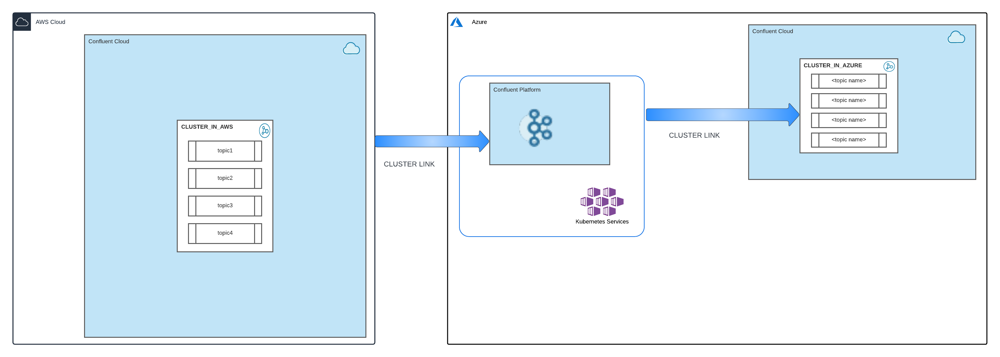

# cluster-link-chain-cfk

This repository provides instructions to deploy a basic Confluent Platform with tls and basic authentication enabled. 
Cluster link will be setup between ccloud cluster and CFK cluster and also chain the CFK cluster to another ccloud cluster.




## Deploy Confluent Platform using Confluent for Kubernetes


### Generate private key
```
openssl genrsa -out ./certs/rootCAkey.pem 2048
```

### Generate CA certificate
```
openssl req -x509 -new -nodes \
-key ./certs/rootCAkey.pem \
-days 3650 \
-out ./certs/cacerts.pem \
-subj "/C=US/ST=CA/L=MVT/O=TestOrg/OU=Cloud/CN=TestCA"
```


### Generate server certificate

Update hosts section in kafka-server-domain.json to include hostnames based on your namespace. Add all component hosts kafka,zookeeper, controlcenter etc

```
cfssl gencert -ca=./certs/cacerts.pem \
-ca-key=./certs/rootCAkey.pem \
-config=./certs/ca-config.json \
-profile=server ./certs/kafka-server-domain.json | cfssljson -bare ./certs/kafka-server
```

### Create Secrets 

```
kubectl -n confluent create secret generic source-tls-group1 \
--from-file=fullchain.pem=kafka-server.pem \
--from-file=cacerts.pem=cacerts.pem \
--from-file=privkey.pem=kafka-server-key.pem

kubectl -n confluent create secret generic credential \
--from-file=plain-users.json=creds-kafka-sasl-users.json \
--from-file=plain.txt=creds-client-kafka-sasl-user.txt \
--from-file=basic.txt=creds-basic-users.txt


kubectl -n confluent create secret generic rest-credential \
--from-file=basic.txt=rest-credential.txt


kubectl -n confluent create secret generic password-encoder-secret \
--from-file=password-encoder.txt=passwordencoder.txt


```


### Deploy the Cluster 

Ensure that replicas and namespace and correct and according to your requirements.


```
kubectl apply -f zk-kafka.yaml 
```

Check the pod status and ensure there are no issues deploying the cluster.

```
% kubectl get pods
NAME          READY   STATUS    RESTARTS      AGE
kafka-0       1/1     Running   0             101m
kafka-1       1/1     Running   0             101m
kafka-2       1/1     Running   0             90m
zookeeper-0   1/1     Running   0             101m
```

## Create destination intiated Cluster Link

In this step we will create destination initiated cluster link between Confluent Cloud and Confluent Platform.


### create a JAAS config ccloud-jaas.conf with API-KEY/SECRET credentials for Confluent Cloud
```
sasl.jaas.config=org.apache.kafka.common.security.plain.PlainLoginModule   required username='[API_KEY]'   password='[SECRET]';
```

### create required secrets
Create the ccloud secret from the JAAS file
```
kubectl -n confluent create secret generic ccloud-credential-source --from-file=plain-jaas.conf=ccloud-jaas.conf
```

### create required certificates to connect to Confluent Cloud

Get the certificates for the ccloud cluster. This will return the server cert and the CA cert in that order.
Save these certs in fullchain.pem and cacert.pem respectively.

```
openssl s_client -showcerts -servername <FQDN> \
-connect <REST-endpoint>  < /dev/null
```

> INFO
> Use FQDN of the Confluent Cloud REST endpoint

Example:
```
openssl s_client -showcerts -servername pkc-xxxx.us-east-1.aws.confluent.cloud -connect pkc-xxxx.us-east-1.aws.confluent.cloud:443
```

### Set up secrets
#### create secret for the certificates to connect to Confluent Cloud
```
kubectl -n confluent create secret generic source-tls-ccloud \
    --from-file=fullchain.pem=fullchain.pem \
    --from-file=cacerts.pem=cacert.pem 
    
```


### Validate the cluster link 

```
kubectl get confluent 
```
```
NAME                                                         ID                       STATUS    DESTCLUSTERID            SRCCLUSTERID             MIRRORTOPICCOUNT   AGE
clusterlink.platform.confluent.io/clusterlink-sourcelink   WDujKk9wTMy0MvilqoHabA   CREATED   klBvtiZsT1Of52BvPL8mKw   lkc-xxxxxx               1                  113m
```


#### Exec into source kafka pod
    kubectl -n confluent exec kafka-0 -it -- bash

#### Create kafka.properties
```
cat <<EOF > /tmp/kafka.properties
bootstrap.servers=kafka.operator.svc.cluster.local:9071
sasl.jaas.config=org.apache.kafka.common.security.plain.PlainLoginModule required username=kafka password=kafka-secret;
security.protocol=SASL_SSL
sasl.mechanism=PLAIN
ssl.keystore.location=/mnt/sslcerts/keystore.p12
ssl.keystore.password=findthepassword
ssl.truststore.location=/mnt/sslcerts/truststore.p12
ssl.truststore.password=findthepassword
EOF
```

#### List in CFK cluster to validate the mirror topic is created
    kafka-topics --list topic.from.source --bootstrap-server kafka.operator.svc.cluster.local:9071 --producer.config /tmp/kafka.properties


Optionally you can also run kafka-console-consumer to consume messagse and validate.


## Create the Source Initiated Cluster Link

In this step we will create a source initiated cluster link from Confluent Platform to Confluent Cloud.

### Create rest class 

Update rest end point and kafka cluster id and apply the manifest file

```
kubectl apply -f kafkarestclass-ccloud.yaml
```


- Create a file `basic_creds_dest.txt` with API Key and API secret in this format
```
username=xxx
password=xxxxx
```
- Create  a secret with this API key and secret
```
kubectl -n confluent create secret generic restclass-ccloud --from-file=basic.txt=basic_creds_dest.txt
```

- Create a file `ccloud_jaas_dest.text` with API Key and API secret in this format
```
sasl.jaas.config=org.apache.kafka.common.security.plain.PlainLoginModule required username="xxxx" password="xxxxxxxxxxx";
```
- Create  a secret with this API key and secret
```
kubectl -n confluent create secret generic jaasconfig-ccloud --from-file=plain-jaas.conf=ccloud_jaas_dest.text
```

Note: If you need the server certificates for the ccloud cluster, use the following command. This will return the server cert and the ca cert in that order
Save these certs in `fullchain_dest.pem` and `cacert_dest.pem`
```
openssl s_client -showcerts -servername pkc-xxxx.eastus.azure.confluent.cloud \
-connect pkc-xxxxxx.eastus.azure.confluent.cloud:443 < /dev/null
```
- We can create a secret with ccloud certs if we want to use them.
```
kubectl -n confluent create secret generic ccloud-tls-certs \
--from-file=fullchain.pem=fullchain_dest.pem --from-file=cacerts.pem=cacert_dest.pem
```

### Create source initiated clusterlink on CCLOUD
Once all secrets are created and validated against the manifest files, create cluster link between CFK cluster(source) and ccloud cluster(destination).


Cluster link will be created in the ccloud cluster.

```
    kubectl apply -f clusterlink-ccloud-dst.yaml
    kubectl apply -f clusterlink-ccloud-src.yaml
```


## Run Cluster link test

#### Login to ccloud with confluent CLI.
This is described in `Setup CLI` section in ccloud

    confluent login --save
    confluent environment use <env name>
    confluent kafka cluster use <clusterId>
    confluent api-key use <API-KEY>

#### Produce message in source topic
Consume messages from `topic.from.source`. This is the source topic and messages will be mirrored to CFK cluster

    confluent kafka topic produce topic.from.source 


#### Produce message
Consume messages from `topic.from.source` from the destination cluster. This is the mirrored topic and this should have the message produced above
in the source Confluent Cloud cluster.

    confluent environment use <env name>
    confluent kafka cluster use <clusterId>
    confluent api-key use <API-KEY>
    
    confluent kafka topic consume -b topic.from.source